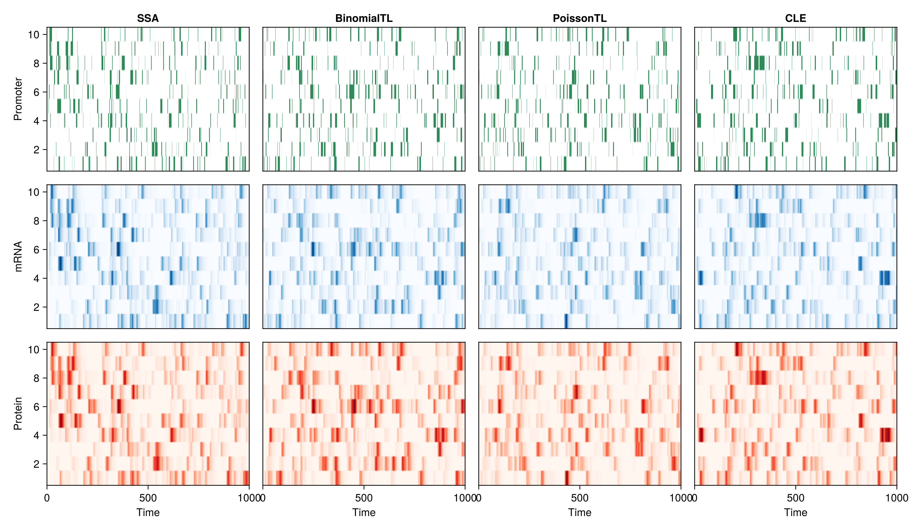
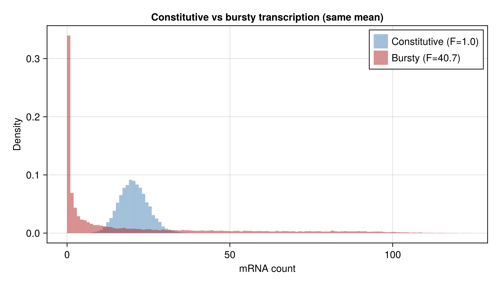
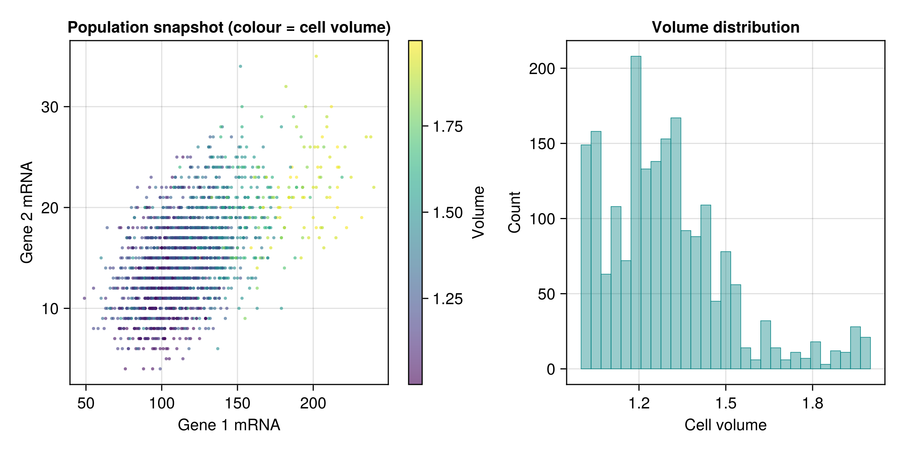
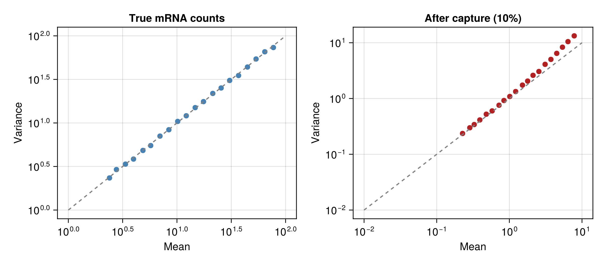
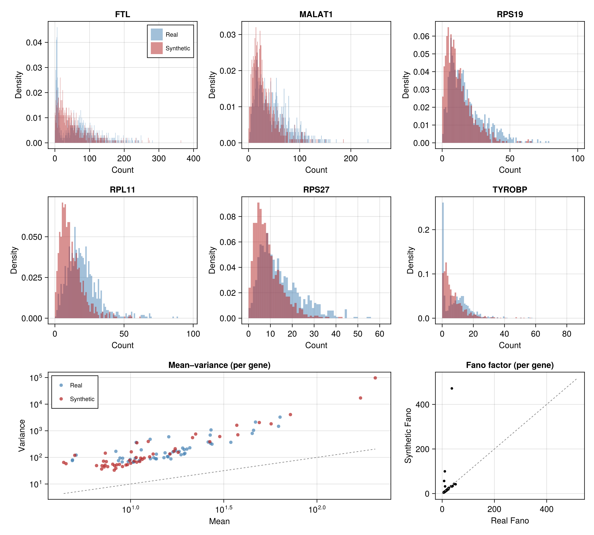
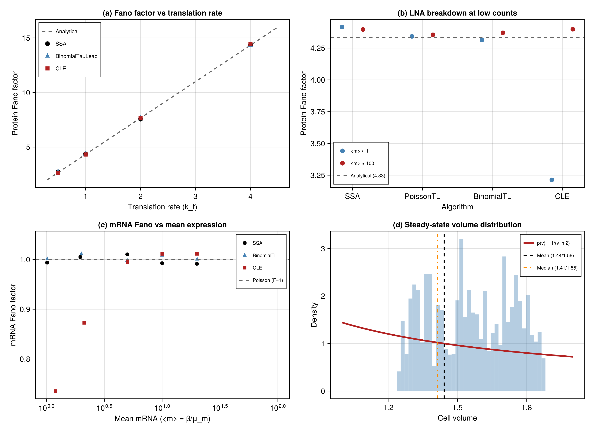
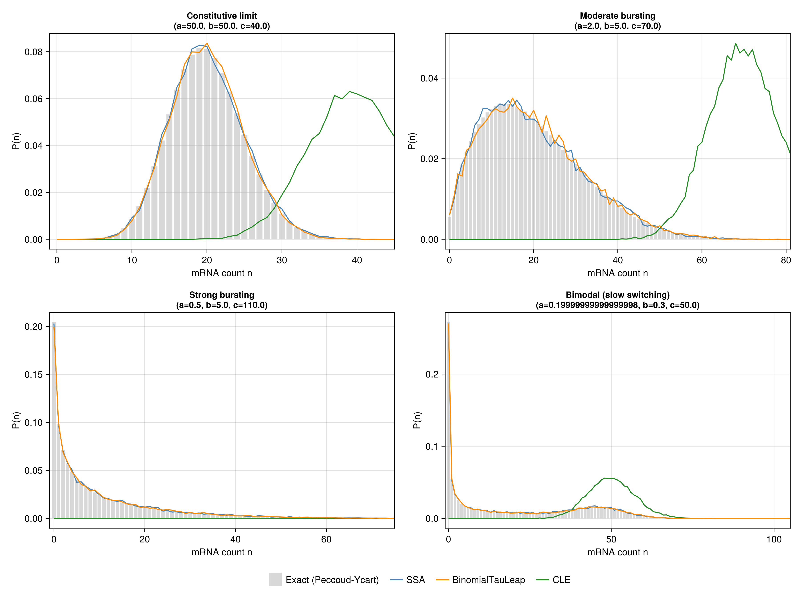
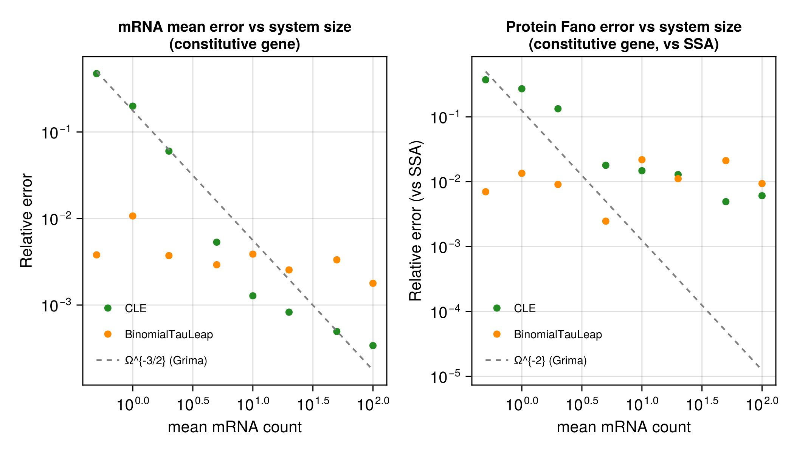

# SyntheticscRNAseq.jl

A pure Julia, GPU-accelerated simulator for generating synthetic scRNA-seq data from stochastic gene regulatory network models.

SyntheticscRNAseq.jl provides seven CPU and two GPU simulation algorithms for the two-stage model of gene expression (transcription and translation) with Hill-function regulation, telegraph promoter switching, cell population dynamics and a scRNA-seq capture/dropout model. All algorithms are validated against exact analytical results from stochastic gene expression theory.

## What it does

The package simulates the full pipeline from gene regulatory network parameters to synthetic scRNA-seq count matrices. A gene network is defined by basal transcription rates, a regulatory interaction matrix and optionally per-gene promoter switching rates (telegraph/bursting model). The simulator propagates mRNA and protein counts for each cell using one of several stochastic algorithms, then applies a LogNormal-Binomial capture model that mimics the molecule sampling and cell-to-cell efficiency variation seen in real 10x Chromium data.

The population dynamics module implements a Moran process with exponential volume growth, volume-dependent transcription and binomial molecule partitioning at cell division. This produces the correct steady-state volume distribution and emergent dilution effects without an explicit dilution rate term.



## Regulation

Gene regulatory interactions use Hill-function kinetics with three edge types that can be freely combined in a single network. Additive regulation is the standard model where each regulator contributes independently via `sum_j hill(p_j, a_ij * beta_i, K, n)`, with activation and repression strengths stored in the interaction matrix A. Cooperative (AND-gate) regulation activates a gene only when all source TFs are bound, computed as `strength * beta * prod(hill(p_src))`. Redundant (OR-gate) regulation activates a gene when any source TF is bound, computed as `strength * beta * (1 - prod(1 - hill(p_src)))` using inclusion-exclusion, which for two sources reduces to `strength * (h1 + h2 - h1*h2)`.

The default network sampler uses mixed regulation, which combines all three types. All regulation types are supported by all algorithms (SSA, tau-leap variants, CLE).

The `sample_network` function controls network sparsity via keyword arguments whose defaults scale with G to keep density realistic:

| Parameter | G ≤ 5 | G ≤ 10 | G > 10 |
| --- | --- | --- | --- |
| `n_tf_range` | 1:2 | 2:3 | 4:5 |
| `targets_per_tf_range` | 1:3 | 2:4 | 3:6 |
| `n_coop_range` | 0:1 | 0:1 | 1:2 |
| `n_redun_range` | 0:1 | 0:1 | 1:2 |

Small networks use fewer TFs and targets to avoid saturation (where every gene regulates every other). Large networks guarantee at least one cooperative and one redundant edge to maintain regulatory complexity. All defaults can be overridden:

```julia
net = sample_network(10; regulation=:mixed)

# Override defaults for sparser networks
net = sample_network(20; n_tf_range=2:3, targets_per_tf_range=2:3)

# Manual construction
coop = [CoopEdge(3, [1, 2], 5.0)]   # gene 3 needs both TF1 AND TF2
redun = [RedunEdge(4, [1, 5], 4.0)]  # gene 4 needs TF1 OR TF5
net = GeneNetwork(5, basals, A, coop, redun)
```

## Telegraph promoter model

Each gene can optionally switch between an ON state (transcribes at rate beta) and an OFF state (silent), with rates k_on and k_off. This produces transcriptional bursting with burst size b = beta/k_off and burst frequency f = k_on. The mRNA Fano factor is F = 1 + b/(1 + k_on/k_off + mu_m/k_off), which in the bursty limit reduces to F = 1 + b. Genes with k_on = k_off = Inf (the default) behave as constitutive.



## Population dynamics

When a PopulationConfig is provided, cells grow exponentially in volume and divide when reaching a threshold. At division, molecules are partitioned binomially between mother and daughter, and the daughter replaces a random cell in the population (Moran replacement). Transcription rate scales linearly with cell volume, so larger cells produce more mRNA. There is no explicit dilution term in this mode because dilution is emergent from the division process.

For simulations without explicit population dynamics, the dilution field on KineticParams adds a constant dilution rate to both mRNA and protein decay, giving the analytical steady state: mean mRNA = beta/(mu_m + mu) and protein Fano = 1 + k_t/(mu_m + mu_p + 2*mu).



## Capture model

The CaptureModel applies a LogNormal-Binomial dropout process to true molecule counts. Each cell receives a capture efficiency drawn from a LogNormal distribution, then each molecule is independently captured with that probability. This reproduces the sparsity, library size variation and overdispersion structure observed in real scRNA-seq data.



## Algorithms

The package provides seven CPU algorithms and two GPU algorithms. All share the same interface through the simulate function and accept identical network, kinetics and population parameters.

| Algorithm | Type | Time (G=5, 5000 cells) | Max mean error | Max variance error |
| --- | --- | --- | --- | --- |
| SSA | Exact (Gillespie) | 14.3s | reference | reference |
| PoissonTauLeap | Tau-leap | 6.8s | 0.4% | 5.7% |
| BinomialTauLeap | Tau-leap | 10.0s | 2.4% | 6.3% |
| MidpointTauLeap | Tau-leap | 9.3s | 0.8% | 6.2% |
| CLE | Langevin SDE | 1.2s | 0.7% | 7.6% |
| CLEFast | Langevin SDE | 1.3s | 0.5% | 3.3% |
| BinomialTauLeapFast | Tau-leap | 7.6s | 2.8% | 4.1% |
| **GPU CLE** | **Langevin SDE** | **0.22s** | **0.6%** | **2.9%** |
| **GPU BinomialTauLeap** | **Tau-leap** | **0.45s** | **2.2%** | **4.6%** |

Timings measured on an NVIDIA RTX 5060. The GPU variants (CLE and BinomialTauLeap) are loaded automatically when CUDA.jl is available and provide batched simulation via cuBLAS strided batched GEMM for training data generation. The GPU BinomialTauLeap uses Poisson inverse CDF sampling for discrete event counts, which is exact up to the truncation point (50 terms, covering λ up to ~35).

The default_algorithm function returns BinomialTauLeapFast for networks with 10 or fewer genes and CLE for larger networks. BinomialTauLeapFast uses StaticArrays for compile-time-specialised matmuls and Polyester for multithreading. CLE uses standard BLAS matmuls which scale better for large G.

## Comparison with real data

The experiments directory includes a script that downloads the 10x Genomics PBMC 3K dataset, subsets to CD14+ monocytes and compares summary statistics against synthetic output. With per-gene telegraph calibration (basal rates and burst parameters fitted from observed means and Fano factors), the simulator reproduces the marginal count distributions, mean-variance relationship and overdispersion of real scRNA-seq across high, medium and low variance genes.



## Analytical validation



The test suite (183 tests) validates all algorithms against exact results from stochastic gene expression theory.

The two-stage model moments (Thattai and van Oudenaarden 2001) are checked for mRNA mean, mRNA variance, protein mean, protein Fano factor and mRNA-protein covariance across all seven CPU algorithms. The Fano factor relationship F = 1 + k_t/(mu_m + mu_p) is verified across a sweep of translation rates.

The dilution model is validated by comparing molecule concentrations (counts divided by volume) between the population model and the constant-dilution model. The volume distribution in the Moran population is tested against the analytical prediction: mean volume = V_div/(2 ln 2), inverse volume = 2 ln 2/V_div, and median volume = V_div/sqrt(2).

The Grima LNA breakdown test confirms that BinomialTauLeap produces more accurate Fano factors than the CLE at low molecule counts (mean mRNA around 1), where the Gaussian diffusion approximation fails. At high counts (mean mRNA around 100), the CLE recovers its accuracy.

### Telegraph model: exact distributional validation



Beyond moment-level checks, the package validates the full mRNA probability distribution against the exact Peccoud-Ycart (1995) steady-state solution for the two-state telegraph model. The exact PMF is

    P(n) = exp(-c) * c^n / n! * (a)_n / (a+b)_n * 1F1(b; a+b+n; c)

where a = k_on/mu_m, b = k_off/mu_m, c = beta/mu_m are dimensionless switching and transcription rates, (a)_n is the Pochhammer symbol, and 1F1 is Kummer's confluent hypergeometric function. The implementation uses the Kummer transform to ensure numerical stability for large c (all series terms positive, no cancellation).

The `telegraph_distribution`, `telegraph_mean`, `telegraph_variance` and `telegraph_fano` functions are exported and can be used directly for analytical comparisons:

```julia
using SyntheticscRNAseq

a, b, c = 2.0, 5.0, 70.0  # moderate bursting
p_exact = telegraph_distribution(a, b, c)   # full PMF vector
telegraph_mean(a, b, c)      # = 20.0
telegraph_fano(a, b, c)      # = 7.25
```

Four parameter regimes are tested covering the full range of telegraph behaviour: constitutive (fast switching, near-Poisson), moderate bursting (overdispersed unimodal), strong bursting (geometric-like tail), and bimodal (slow switching with distinct OFF and ON peaks). SSA, BinomialTauLeap and CLE empirical distributions are compared against the exact PMF using the Kolmogorov-Smirnov statistic and L1 distance.

### CLE accuracy scaling (Grima 2011)



Grima (2011) showed that CLE errors scale as O(omega^{-3/2}) for non-equilibrium systems, where omega is the effective molecule count. The validation script sweeps the mean mRNA count from 1 to 200 by varying basal transcription rate, measuring CLE and BinomialTauLeap errors against the exact telegraph moments. The CLE error decreases with system size following the predicted power law, while BinomialTauLeap maintains uniformly low error across all system sizes including the low-count regime where the CLE's Gaussian diffusion approximation breaks down.

## Installation

```julia
using Pkg
Pkg.add(url="https://github.com/msturroc/SyntheticscRNAseq.jl")
```

For GPU support, also install CUDA.jl:

```julia
Pkg.add("CUDA")
```

## Quick start

```julia
using SyntheticscRNAseq

# Define a 5-gene network with sparse regulation
basals = [2.0, 1.5, 3.0, 2.5, 1.0]
A = zeros(5, 5)
A[1, 2] = 5.0   # gene 2 activates gene 1
A[3, 1] = -4.0  # gene 1 represses gene 3
net = GeneNetwork(basals, A)

# Kinetic parameters with growth-coupled dilution
kin = KineticParams(k_t=2.0, K_d=50.0, n=4.0,
                    mu_m=0.1, mu_p=0.2, dilution=0.03)

# Simulate 1000 cells using the default algorithm
alg = default_algorithm(5)
Y = simulate(net, alg, kin; cell_num=1000, T=300.0, readout=:mrna)

# Apply scRNA-seq capture model
cap = CaptureModel(efficiency=0.1, efficiency_std=0.3, readout=:mrna)
Y_obs = apply_capture(Y, cap)
```

For bursty transcription, provide per-gene switching rates:

```julia
# Telegraph model: k_on=0.02, k_off=0.2 gives burst size = beta/k_off
net_bursty = GeneNetwork(basals, A;
                         k_on=fill(0.02, 5),
                         k_off=fill(0.2, 5))
Y_bursty = simulate(net_bursty, BinomialTauLeap(0.05), kin;
                    cell_num=1000, T=500.0, readout=:mrna)
```

For population dynamics with volume-dependent transcription:

```julia
pop = PopulationConfig(cell_num=1000, growth_rate=0.03,
                       V_div=2.0, V_init=(0.8, 1.2))
Y_pop = simulate(net, BinomialTauLeap(0.1), kin;
                 cell_num=1000, T=300.0, readout=:mrna,
                 population=pop)
```

## Running the tests

```julia
using Pkg
Pkg.test("SyntheticscRNAseq")
```

## References

Thattai M, van Oudenaarden A. Intrinsic noise in gene regulatory networks. PNAS, 2001.

Peccoud J, Ycart B. Markovian modeling of gene product synthesis. Theoretical Population Biology, 1995.

Cao Z, Grima R. Analytical distributions for detailed models of stochastic gene expression in eukaryotic cells. PNAS, 2020.

Thomas P, Shahrezaei V. Coordination of gene expression noise with cell size. Cell Systems, 2021.

Grima R, Thomas P, Straube AV. How accurate are the nonlinear chemical Fokker-Planck and chemical Langevin equations? Journal of Chemical Physics, 2011.

Grima R. An effective rate equation approach to reaction kinetics in small volumes. Journal of Chemical Physics, 2010.

Chatterjee A, Vlachos DG, Katsoulakis MA. Binomial distribution based tau-leap accelerated stochastic simulation. Journal of Chemical Physics, 2005.
